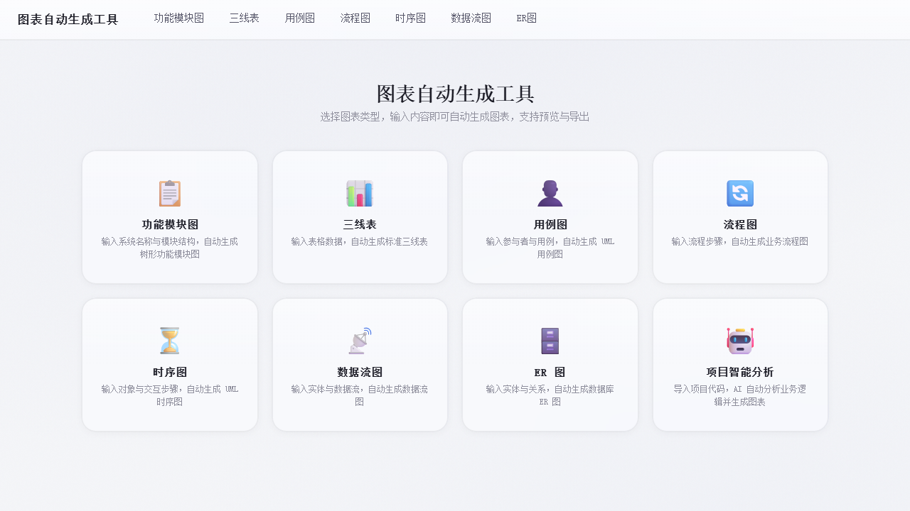

# 图表自动生成工具

一个面向课程设计、论文文档和项目分析场景的图表自动生成工具。用户可以手动填写结构化内容，也可以导入项目代码，由系统分析项目结构并辅助生成图表。

<p align="center">
  
</p>

## 项目亮点

- 覆盖功能模块图、三线表、用例图、流程图、时序图、数据流图和 ER 图。
- 支持 ZIP 上传和 GitHub 仓库导入。
- 通过代码解析器提取 Controller、Service、Entity、数据库表、路由和 API 等结构化信息。
- 调用 DeepSeek 辅助分析项目业务逻辑，并将结果转换为可渲染的图表数据。
- AI 调用失败时，根据已解析的项目结构生成基础图表，保证流程可继续使用。
- 支持图表预览、JSON 查看和图片导出，适合直接插入课程设计或论文文档。

## 页面功能

| 页面 | 用途 |
| --- | --- |
| 功能模块图 | 根据系统名称和模块层级生成树形功能图 |
| 三线表 | 根据字段和内容生成规范三线表 |
| 用例图 | 根据参与者和用例关系生成 UML 用例图 |
| 流程图 | 根据业务步骤生成流程图 |
| 时序图 | 根据对象交互过程生成 UML 时序图 |
| 数据流图 | 根据外部实体、加工处理、数据存储和数据流生成数据流图 |
| ER 图 | 根据实体、字段和关系生成数据库 E-R 图 |
| 项目智能分析 | 导入项目代码后，分析项目结构并批量生成图表 |

## 技术栈

### 前端

- Vue 3
- Vite
- TypeScript
- Vue Router
- Element Plus
- Mermaid
- html-to-image
- file-saver

### 后端

- Node.js
- Express
- TypeScript
- Axios
- Multer
- adm-zip
- simple-git
- Zod

## 项目结构

```text
zhitu
├─ src
│  ├─ components               公共组件
│  ├─ router                   前端路由
│  ├─ styles                   全局样式
│  ├─ utils                    图表渲染、导出和本地存储工具
│  └─ views                    各类图表页面
├─ server
│  ├─ src
│  │  ├─ routes                上传、导入和分析接口
│  │  ├─ services              代码解析、AI 调用和图表生成服务
│  │  └─ types                 请求和图表类型定义
│  ├─ .env.example             后端环境变量模板
│  └─ package.json
├─ docs/images                 README 产品截图
├─ package.json
├─ vite.config.ts
└─ README.md
```

## 项目智能分析流程

1. 用户上传 ZIP 文件或填写 GitHub 仓库地址。
2. 后端保存或克隆项目，并过滤依赖、构建产物和二进制文件。
3. 代码解析器提取项目目录、技术栈、接口、实体、数据表和路由等信息。
4. 后端将结构化摘要发送给 DeepSeek，按用户选择的图表类型并行生成结果。
5. 对模型结果做格式标准化；单个图表失败时使用本地规则兜底。
6. 前端缓存图表数据，使用 Mermaid 渲染，并支持预览和导出。

## 本地运行

### 环境要求

- Node.js 18+
- npm 9+

### 启动前端

```powershell
npm install
npm run dev
```

前端默认地址：`http://localhost:5173`

### 启动后端

```powershell
cd server
npm install
Copy-Item .env.example .env
npm run dev
```

根据本机环境配置 `server/.env`。项目智能分析功能需要 DeepSeek API Key，Key 由用户在页面中输入，不应写入仓库。

### 构建

```powershell
npm run build

cd server
npm run build
npm run start
```

## 安全与仓库说明

- 不要提交 `.env`、`server/.env`、API Key 或其他真实密钥。
- 上传项目会过滤 `node_modules`、`dist`、`.git` 和常见二进制文件。
- 当前项目分析数据暂存于后端内存中，并在一段时间后清理，适合演示和课程设计场景。
- 生产环境还应增加用户鉴权、请求限流、HTTPS、密钥脱敏和持久化任务管理。

## License

暂未声明开源许可证。
